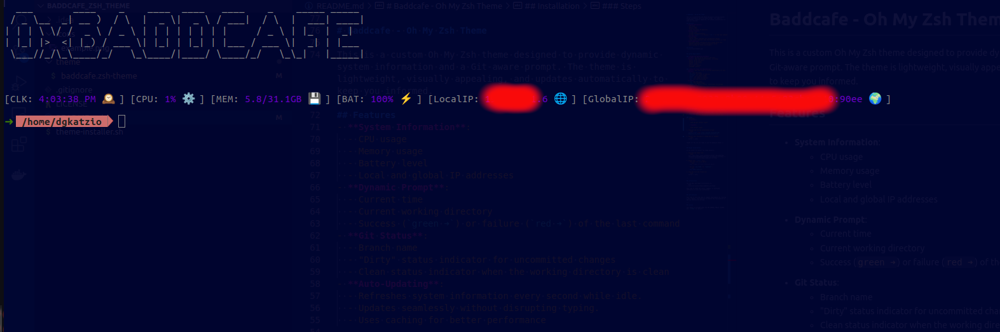

# Baddcafe - Oh My Zsh Theme

This is a custom Oh My Zsh theme designed to provide dynamic system information and a Git-aware prompt. The theme is lightweight, visually appealing, and updates automatically to keep you informed.

## Features
- **System Information**:
  - CPU usage
  - Memory usage
  - Battery level
  - Local and global IP addresses
- **Dynamic Prompt**:
  - Current time
  - Current working directory
  - Success (`green ➜`) or failure (`red ➜`) of the last command
- **Git Status**:
  - Branch name
  - "Dirty" status indicator for uncommitted changes
  - Clean status indicator when the working directory is clean
- **Auto-Updating**:
  - Refreshes system information every second while idle.
  - Updates seamlessly without disrupting typing.
  - Uses caching for better performance

## Preview


---

## System Requirements

### **Supported Operating Systems**
- **macOS**: Version 10.12 (Sierra) and later
- **Linux**: Most modern distributions, including:
  - Ubuntu (16.04 and later)
  - Debian (9 and later)
  - CentOS (7 and later)
  - Fedora (latest)
  - Arch Linux (latest)
  - openSUSE (latest)

### **Required Tools and Dependencies**
- **Shell**: Zsh (the script is written specifically for Zsh)
- **macOS**:
  - `ps` (for CPU usage)
  - `ifconfig` (for local IP address)
  - `vm_stat` (for memory usage)
  - `pmset` (for battery status)
  - `curl` (for global IP address)
  - `awk` (for text processing)
- **Linux**:
  - `top` (for CPU usage)
  - `free` (for memory usage)
  - `upower` (for battery status, installable via package manager)
  - `hostname` (for retrieving local IP address)
  - `curl` (for global IP address)
  - `awk` (for text processing)
- **Terminal Support**:
  - Terminal should support **ANSI escape sequences** for color coding and background changes.

### **Optional**:
- **Git**: For git prompt information (if using Git in your terminal).

## Installation

You can install the theme using the provided installation script.

---
### Prerequisites
1. **Zsh**: Ensure Zsh is your default shell ($ `echo $SHELL`).
2. **Oh My Zsh**: Ensure you have Oh My Zsh installed. You can install it from [Oh My Zsh's official site](https://ohmyz.sh/).
3. [Powerline fonts](https://github.com/powerline/fonts)
4. **figlet**: Used for drawing ascii art on terminal init

### Steps
1. (Optional)
    * **Linux**:
      ```
      sudo apt-get install figlet
      ```
    * **macOS**:
      ```
      brew install figlet
      ```
2. Download and run the installation script:
   ```bash
   zsh <(curl -fsSL https://github.com/dimgatz98/Baddcafe_zsh_theme/raw/main/theme-installer.sh)
   ```
3. Restart your terminal or reload Zsh (if needed):
   ```bash
   source ~/.zshrc
   ```

That’s it! You are now ready to use the Baddcafe theme! 🎉

---

## Manual Installation

If you prefer to install the theme manually:

1. Download the theme file:
   ```bash
   curl -fsSL https://gist.githubusercontent.com/dimgatz98/1d1363667ff4c64398b9a2e6f03c1322/raw/baddcafe.zsh-theme -o ~/.oh-my-zsh/custom/themes/baddcafe.zsh-theme
   ```
2. Update your `.zshrc` file:
   - Open the file in an editor:
     ```bash
     vim ~/.zshrc # or your favourite editor
     ```
   - Set the `ZSH_THEME` to `"baddcafe"`:
     ```zsh
     ZSH_THEME="baddcafe"
     ```
3. Save the file and reload Zsh:
   ```bash
   source ~/.zshrc
   ```

---

## Customization

You can edit the theme file directly at:
```bash
~/.oh-my-zsh/custom/themes/baddcafe.zsh-theme
```
Feel free to tweak the colors, symbols, or displayed information to suit your preferences.

---

## Contributions

Feel free to fork the repo or suggest improvements by creating a pull request. Contributions to enhance the functionality or add new features are welcome.

---

## License

This theme is provided under the GNU GENERAL PUBLIC LICENSE. See `LICENSE` for details.
